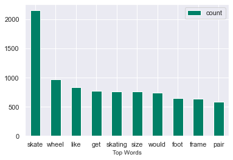
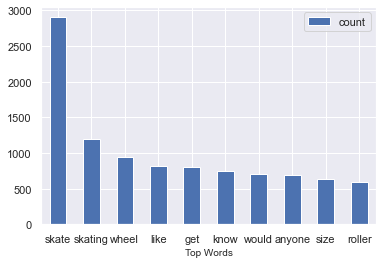

# Subreddit Identification in Online Forums
---

The goal of this project is to take data from Reddit using the `Pushshift` API to then identify whether or not a given post is from a rollerskating subreddit or a rollerblading subreddit. We want to build and train multiple models in order to find the best optimization for these predictions.

The project consists of 3 parts, webscraping and data gathering, data cleaning and Exploratory Data Analysis, pipeline implementation and modeling with evaluations.

### Repository Organization
* The included notebook is `Subreddit_NLP.ipynb`. This is where all project work was done from start to finish.

* Data Folder: Consists of scraped data, cleaned data, word count data and concatenated data.
* README file: Contains the project overview and executive summary.

## Prerequisites and Requirements
---
The following Python libraries were used in this project

* Numpy

* pandas
* requests

* matplotlib

* seaborn

* NLTK

* regex

* collections

* requests

* logging

* time

## Webscraping and Data Compilation
---

We first start with setting the url address to a variable. Then a function is used to iterate through each page of our respective subreddits and pull the submissions. The submissions are then converted to a dataframe and concatenated to a list. The dataframes were then written to a csv file. This is done with both the *rollerskating* and *rollerblading* subreddits. 

## Data Cleaning and EDA
---
To clean the data, we read in our newly saved csv files and then drop all rows except `title`, `selftext`, and `subreddit`. We replace Nan values with a space and then view the datatypes of each feature. this is where our cleaning function comes in. Through our `cleanup` function, we use `re.sub` to remove special characters and keep only upper and lower case letters. The words are then converted to all lowercase. *Stop words* are defined by using nltk and and then used to remove the stop words in each dataframe. Lastly, the `cleanup` function lemmatizes the words and joins them back together.

A tokenizer function was then used to see the relationships between words better. Both functions helped in converting the data into a new, cleaned dataframe that included 2 columns for the cleaned and tokenized text along with text length.

Nan values were converted to floats and again dropped in the clean dataframes. The cleaned text was then used to create a new dataframe for each subreddit that consisted of word count.

Next, we viewed the relationships among most similar words using `Word2Vec` for the top 2 words in the `clean_text_tok` colum and the top word *skate* from the `title` column. The word count dataframes created from each subreddit were concatenated in order to plot and compare the top word counts.

## Modeling and Methodology
---

Three model's were used for binary classification. All models had Count Vectorizer applied to them, with the first model being our baseline and the following two models being put through a pipeline and fit with Grid Search. OUr accuracy score remained at roughly 89% for all models.

1. Baseline Model: Multinomial Naive Bayes
    - Parameters set to default
    - Train Score: 99.05%
    - Test Score: 89.29%
    - Roc_auc Score: 96.1%
2. Random Forest Classifier Model
    - Parameters customized (see notebook)
    - Train Score: 98.22%
    - Test Score: 96.58%
    - Roc_auc Score: 89.31%
3. Logistic Regression Model
    - Parameters customized (see notebook)
    - Train Score: 99.99%
    - Test Score: 95.69%
    - Roc_auc Score: 88.93%
    
A confusion matrix was made using the *best estimator* in order to view the relationship between our true positives, true negatives, false positives and false negatives. This was used along with a classification report to further analyze the relationships between precision and recall for each model.

## Conclusions and Recommendations
---

In conclusion, in relation to our problem statement, we can predict- fairly accurately- which submission a subreddit came from. If we want the best results, we should use our random forest classifier model. This model has the smallest margin between the training and testing scores, meaning that though the model is slightly overfit, it is still good at predicting our y_predict values. 

Though logistic regression had the highest training score, there was a larger margin of overfitting between the train and test scores, and the roc_auc score was the lowest of all models at 88%.

* Logistic regression and the random forest classifier both used Grid Search to find the best estimator for our models.
* 7 out of our top 10 words overlapped between both models
* The model with the highest test score was our Count Vectorized Logistic Regression model.
* The model with the lowest margin of overfitting was our count vectorized, random foreset classifier.
* Our random forest classifier also had the lowest number of false positives at 37, however our false negatives were the highest at 97.
* Our best parameters for random forest were:
    - CountVectorizer(ngram_range=(1, 2))
    - RandomForestClassifier(class_weight={0: 1, 1: 1}
    - max_depth=30 
    - min_samples_leaf=3
    - min_samples_split=3
    - n_estimators=120
    
    
 ### Recommendations
 
 * Our next steps would be to change and optimize the random forest parameters in order to get a higher training score with a lower margin of overfitting (example- TFIDF vectorizer).
 * Inversely, we can also explore the parameters for logistic regression to close the gap between the training and testing scores. 
 * Try a KNN model through a pipeline with gridsearch and adjust the KNN neighbors.
 * Try an SVM model through a pipeline with gridsearch.
 * Change the data to view comments vs submissions in subreddit.
